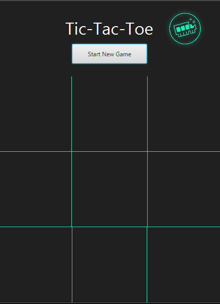

# TicTacToe
Game made within Adam Mickiewicza University Faculty of Mathematics and Computer Science's Student Academic Circle - Byte IT, as a attracion for Faculty's event "Week with Student Academic Circles"

The game uses MinMax Algorithm with Alpha-Beta Pruning optimization 
 
Enjoy!

